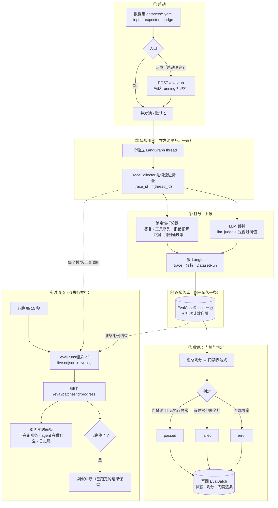

# 智能体测评（Eval）—— Langfuse 闭环

把智能体的运行接进 Langfuse，形成完整的评测回路：

```
观测(Trace) → 沉淀(Dataset) → 实验(Runner + Scorer) → 回归(Gate)
```

设计参照 [dsh-eval-automation](../dsh-eval-automation)（但问智能公开课那套），
移植到本平台的 python 栈，并复用平台已经在跑的 Langfuse 实例。

## 组成

| 模块 | 文件 | 角色 |
| --- | --- | --- |
| 传输层 | `src/app/eval/langfuse_client.py` | 手写 Langfuse HTTP 客户端（ingestion / scores / datasets） |
| 追踪层 | `src/app/eval/tracing.py` | 确定性 traceId + LangGraph 事件流 → trace 树 |
| 评测集 | `src/app/eval/dataset.py` | YAML 评测集加载（与 dsh 同格式，可互相搬运） |
| 打分器 | `src/app/eval/scorers.py` | 确定性打分器 + LLM-as-judge |
| 门禁 | `src/app/eval/gate.py` | 门禁表达式解析与求值（与 dsh 同语法） |
| 运行器 | `src/app/eval/runner.py` | 主循环：驱动 agent、打分、上报 |
| CLI | `src/app/eval/cli.py` | 命令行入口 |
| Web 页 | `/eval`（前端）+ `src/app/api/v2/eval.py` | 平台内起批次、看结果 |

## 流程



读图要点：

- **② 到 ④ 是每条用例各走一遍**，不是整批走一遍；所以用例是逐条出现在页面上的。
- **③ 的两层同时打分**，各自产出独立的分数名，门禁再按名字聚合。
- **trace_id 由 thread_id 确定性派生**，这是 runner 能在 agent 进程外把分数挂回正确 trace 的原因。
- **⑤ 的 passed 不等于分数高**：异常只看「用例有没有跑起来」，分数不达标要靠门禁表达式抓；门禁留空时全跑通就是 passed。
- **实时通道与执行并行**（不是事后补的）：心跳是判活依据——一次工具调用可以安静十几分钟，没有心跳就分不清「在跑」和「进程没了」。

## 快速开始

```bash
# 1. 先跑冒烟集：验证链路本身通不通（纯文本任务，无外部依赖）
.venv/bin/python -m src.app.eval.cli --dataset datasets/smoke-testcase.yaml \
  --agent testcase_agent --release smoke --gate "avg(llm_judge)>=0.6" --verify-trace

# 2. 再跑真业务集：Web-UI 自动化智能体（需要 playwright runner 在线）
.venv/bin/python -m src.app.eval.cli --dataset datasets/douban-webui.yaml \
  --concurrency 2 --release v1 \
  --gate "avg(task_output_match)>=0.8 && all(tool_sequence) && avg(webui_cases_all_passed)>=0.8" \
  --verify-trace
```

退出码：`0` 全部用例正常执行且门禁通过；`1` 门禁不通过；`2` 运行本身起不来。
可以直接拿来当 CI 回归门禁。

## 三个关键设计

### 1. 确定性 traceId，让进程外的 runner 也能打分

`trace_id_for(session_id)` 把会话 id 哈希成 Langfuse 要的 32 位 hex trace id
（FNV-1a 双哈希）。runner 从头到尾没有"看过"agent 的运行，却能把分数精确挂到
对应的 trace 上——不需要先查 API 再回填。

**这个算法必须与 dsh-eval-automation 的 `traceIdFor` 逐字节一致**（同一会话在
两套系统里得指向同一条 trace）。`tracing.py` 里有实现，注意那句注释：JS 的
`code >> 8 | code << 8` 不能遮到 16 位，否则非 ASCII 会话 id 会算出不同结果。

### 2. 三层打分器，分层作战

| 层 | 打分器 | 特点 | 用途 |
| --- | --- | --- | --- |
| 确定性 | `task_output_match` / `no_forbidden_content` / `tool_sequence` / `tool_errors` / `evidence_exists` / `webui_case_pass_rate` | 免费、可复现、离线 | **门禁主力** |
| LLM-as-judge | `llm_judge`(0..1) + `llm_judge_pass`(bool) | 一次结构化模型调用 | 无硬规则的判据（"是否真的核实过"） |
| 人工 | Langfuse UI 标注 | 人工校准 judge 本身 | 抽检 |

`webui_case_pass_rate` 是 Web-UI 专用：它从 agent 自己那几次 `webui_run_spec`
调用里读 Playwright CLI 产出的 `report.stats`，衡量**执行**结果。它只在 agent
真的跑了用例时才会产出——这本身就是"有没有真的执行"的证据。

单个打分器抛错不会毁掉整条用例：降级成一枚 CATEGORICAL 备注，确定性分数照常产出。

### 3. 门禁语法（与 dsh 相同）

```
avg(task_output_match)>=0.8   平均分
min(llm_judge)>=0.6           最差一条
max(tool_errors)<=2           最好一条（护栏）
all(tool_sequence)            每条都为真
```

布尔按 1/0 聚合，CATEGORICAL 不参与聚合。
**门禁点了一个没人产出的分数 → 直接判失败**（fail closed）——
门禁里的错别字必须报错，绝不能读成"没有约束"。

## 评测集格式

```yaml
name: douban-webui
description: 豆瓣电影移动站 Web-UI 自动化测评
agent: webui_agent          # LangGraph 图名，--agent 可覆盖
max_repair: 1               # 每条用例允许的自修复轮数
items:
  - id: smoke-001
    input: 交给被测 agent 的任务（会作为 human message 发过去）
    expected:               # 确定性打分器读这一段
      contains: ['豆瓣']     # 最终回答必须包含（任一命中即真）
      not_contains: [...]   # 最终回答不得包含
      tools: { sequence: [webui_run_spec], mode: subsequence }  # subsequence | exact
      evidence: 'artifacts/*.png'   # 必须产出匹配的运行产物
      max_tool_errors: 0    # 工具报错次数上限（NUMERIC）
    judge:                  # LLM-as-judge 读这一段
      criteria: 判据（自然语言，写得越具体越好）
      pass: 0.7             # llm_judge_pass 的阈值
```

`expected` 和 `judge` 都可以只写一个，也都可以不写（只跑不评，适合写用例阶段）。

数据集 `name` 会被镜像到 Langfuse：
- `POST /api/public/datasets` upsert 数据集
- `POST /api/public/dataset-items` 用**确定性 item id**（`smart-test-<数据集>-<用例>`）
  upsert——所以重跑是原地更新，不会每次堆一份新副本
- 跑完把每条 trace 用 `POST /api/public/dataset-run-items` 挂进
  `<数据集>@<release>` 这个 DatasetRun，UI 里可按批次对比

## Langfuse 接线的坑（都在这套 4.36 上实测过）

1. **trace id 可指定**：`trace-create` 的 body 里给 `id` 就是 trace id——这正是
   确定性 id 能生效的前提。
2. **读是最终一致的**，实测约 10-20s（ClickHouse 异步落库）。而且 **trace 行比它
   的 observations / scores 更早可读**，所以"GET 返回 200"不等于"数据齐了"。
   `wait_for_trace(until=...)` 就是为此存在的：轮询到谓词成立为止。
3. **score 的 `value` 类型**：NUMERIC 和 BOOLEAN 都必须传**数字**（布尔传
   `true` 会被 400 拒掉，要传 1/0）；只有 CATEGORICAL 传字符串。
4. **`usageDetails` 的键**是 `input` / `output` / `total` / `cache_read` /
   `cache_write` / `reasoning`，不是 `inputTokens` 那种驼峰。
5. **批量摄取里放 trace + 子节点是安全的**（实测同批与分批结果一致），
   所以一次运行只发一个 ingestion 批次。

## LangGraph 事件流的坑

后端订阅 `stream_mode: ["updates", "messages"]`。**服务端会把 `messages`
拆成两个事件名**：

- `messages/metadata`：一次性发出 `{message_id: {metadata: …}}`，模型的
  `ls_model_name` / `langgraph_node` 只在这里；
- `messages/partial`：token 片段，是一个**数组**，`id` 回指上面的 map。

所以按 `mode == "messages"` 精确匹配会**静默丢掉整个 generation 通道**
（现象：trace 里只剩 trace 行和工具 span，没有 generation，且不报任何错）。
`runner.py` 里那句注释就是为此留的。

`usage_metadata` 只在 `updates` 的完整消息上才有（token 片段里是 null），
所以 token 用量从 `updates` 取；取不到就不写——没有用量是诚实的，编一个不是。

## Web 页（`/eval`）

- 列出 `datasets/*.yaml`（含用例数、是否带 judge、推荐门禁表达式）
- **评测集在页面上增删改**：表单式编辑器（用例卡片：input / 确定性期望 / LLM 裁判三段），
  保存即写回 `datasets/<file>.yaml`（多行文本落成 `|` 块，中文不转义），下拉里立刻可选；
  也可以「复制」一个集子改成变体，或直接手改文件（页面每次打开都从磁盘读回）。
  接口：`GET/POST/PUT/DELETE /eval/datasets[/{file}]`；文件名只允许 `[A-Za-z0-9._-]+.ya?ml`，
  保存前先在临时文件上回读校验，校验不过**不会**覆盖原文件。
- 一键起批次：**数据集可多选**（每个集子起一个独立批次）+ **数据集内可勾选用例**
  （只选中一个集子时出现"用例选择"：全选/全不选，先冒烟两条再全量跑），
  agent / 并发 / release / 门禁，后台跑
- **AI 生成测评集**：选一段或多段历史对话（含工具调用记录）→ 主 LLM 提炼成
  `input/expected/judge` 草稿 → 在编辑器里微调 → 保存成 `datasets/*.yaml`。
  草稿不直接落盘（生成质量不必一次到位，可编辑是关键）；来源列表只列有消息的会话，
  可按模式过滤，记录过长自动保留头尾（`eval/generator.py`）
- 批次列表与详情：每条用例的分数、trace id（可深链到 Langfuse）、
  工具调用序列、产出证据（截图清单）
- 状态页显示 Langfuse 连通性与 judge 端点，并**标出这个模型是独立配置还是继承主 LLM**
  （只显示模型名会被读成"我配过"）。回退解析走的是**设置页那条路径**（DB → .env →
  进程环境），不是进程环境里的 `LLM_MODEL`——容器只在创建时注入 .env，直接读进程环境
  会拿到过期值（页面显示 glm-4.7、agent 实际跑 glm-5.3-flash，就是这条分叉）
- **执行中看得到进度**：活动流（模型生成 / 每次工具调用与耗时）+ 逐条用例落地 +
  实时日志尾，见下节

`datasets/` 目录以 bind mount 挂进 fastapi 容器（`docker-compose.yml`），所以**新写一条
用例不需要重建镜像**；反过来，编辑文件也必须落到这个目录才生效（镜像是构建期的拷贝，
挂载把它盖住了）。

## 监控（日常对话）与测评是两条线

测评只回答"这个集子过没过"，日常使用的问题（这次为什么答歪了、花了多久、调了哪些工具）
要看**监控**链路：

| | 测评 | 监控 |
| --- | --- | --- |
| 触发 | 起批次跑评测集 | 每次对话自动 |
| 配置 | `LANGFUSE_*`（设置页「Langfuse（测评追踪）」） | `LANGFUSE_MONITOR_*`（设置页「Langfuse（监控 · 日常对话）」） |
| 采集 | runner 在 agent 进程外订阅 LangGraph 流重建 | agent 进程内 `MonitorMiddleware`（模型/工具调用 hooks） |
| trace 粒度 | 一条用例一条（确定性 trace id，分数要挂回来） | 一轮对话一条，`sessionId`=会话 id（Langfuse 里按会话聚合） |

两边可以指向同一个 Langfuse 的不同项目/组织，也可以完全不同实例。监控未配置就空转，
上报失败只写日志——旁路不能影响对话。配置热生效：agent 每 15 秒重读 `.env`。

## 执行中的实时进度

一个 6 条用例的批次串行要几分钟——每条用例都要跑完整个 agent run。而批次结果
曾经是**整轮跑完才入库**的，于是页面上长时间只有"用例 0/6"和一个转圈图标：
分不清在跑、卡住了、还是执行进程早就跟着容器重启一起没了。现在三件事一起改：

| 环节 | 做法 |
| --- | --- |
| 落库时机 | `run_dataset` 的 `on_item` 回调在每条用例跑完时**立刻**写 `EvalCaseResult` 并提交，批次计数同步自增（原来在 `outcome` 返回后一次性写） |
| agent 步骤 | `TraceCollector` 每开一个工具 span / 每条 generation 都回调 `note()`；SSE 从"先攒完再解析"改成**边到边处理**（`iter_sse_lines`），否则整个 item 结束前都没有事件可发 |
| 现场文件 | 执行侧边跑边写 `workspace/default/eval-runs/<batchId>/live.ndjson`（事件）+ `live.log`（人读），接口 `GET /eval/batches/{id}/progress` 读磁盘，前端 2 秒轮询 |

**心跳决定 `stale`**：执行进程每 15 秒写一条 heartbeat。进程被杀或容器重启后
文件不再有新行，于是"最后一条心跳多久以前"就是"还活着吗"的唯一可靠证据——比
"最后一条事件多久以前"可靠，因为一次工具调用可以安静地跑很久。记录写着
"运行中"而没有心跳时，界面显示**疑似中断**（并说明已完成的用例结果仍然保留），
而不是永远转圈。判据见 `eval/live.py: is_stale`：

1. 批次在本进程的 `LIVE` 集合里 → 一定在跑；
2. 有心跳文件 → 静默超过 `EVAL_STALE_AFTER_S`（默认 90s）判中断；
3. 连文件都没有 → `START_GRACE_S`（120s）内算启动中，超过判中断。

实测（6 条用例的 douban 集，串行）：

```
[14:44:03] 批次开始 · douban-webui · agent=webui_agent · 6 条用例 · 并发 1
[14:44:03] ▶ smoke-001 开始
[14:44:10]   · smoke-001 调用 webui_runner_status()
[14:44:18]   · smoke-001 调用 webui_screenshot({"url": "https://m.douban.com/movie/", "device": "iPhone 13"…})
[14:44:27]   · smoke-001 webui_screenshot 9.0s 返回 346 字符
```

## 与 dsh-eval-automation 的对照

| 概念 | dsh（TS） | 本平台（python） |
| --- | --- | --- |
| 观测接缝 | cordis `sessionTelemetry` 插件（进程内直采） | LangGraph SSE 流（进程外重建） |
| traceId | `traceIdFor` (FNV-1a) | `trace_id_for`（逐字节同实现） |
| 数据集 | YAML，同字段 | YAML，同字段（可直接搬运） |
| 打分器 | 同名三类 | 同名三类 + Web-UI 执行结果 |
| 门禁 | `avg/min/max/all` + `&&` | 同语法 |
| 用例隔离 | 每条用例一个 harness 子进程 | 每条用例一个 LangGraph thread |
| 分数回挂 | 确定性 traceId，无需查 API | 同 |

差异的根因只有一个：dsh 的插件活在 agent 进程里，能直采事件；本平台的 eval
跑在 agent 进程外，只能从流里重建。代价是拿不到"进程内才知道"的信号（比如
精确的 step 边界），收益是 eval 与被测 agent 完全解耦——agent 崩了不影响打分器。

## 已知限制

- **并发**：LLM 端点会先限流，默认并发 1；`--concurrency 2` 是实测可用的上限附近，
  再高要先压测端点。
- **judge 默认与被测 agent 共用端点**：三项都留空时回退到主 LLM（`LLM_MODEL`）。
  设置页「LLM 裁判（测评打分）」可以独立配置模型/地址/Key，并带**自检**——自检走的是
  与真实打分完全相同的通道（JSON 模式 + 解析），所以"连通"就等于"能判分"；配错模型名
  会当场报错（`模型不存在`），而不是等批次跑到一半才发现（那时每条用例会变成执行异常）。
  建议真正做回归时把 judge 指到另一个模型，否则同一套偏好会同时影响被测行为和评判。
- **trace 里的工具输出会截断**（单个 span 4k 字符），这是有意的：trace 不是日志。
- **没有实现重试**：单条用例失败就是失败，重试语义交给数据集里的 `max_repair`
  由 agent 自己修——那才是被测能力的一部分。
